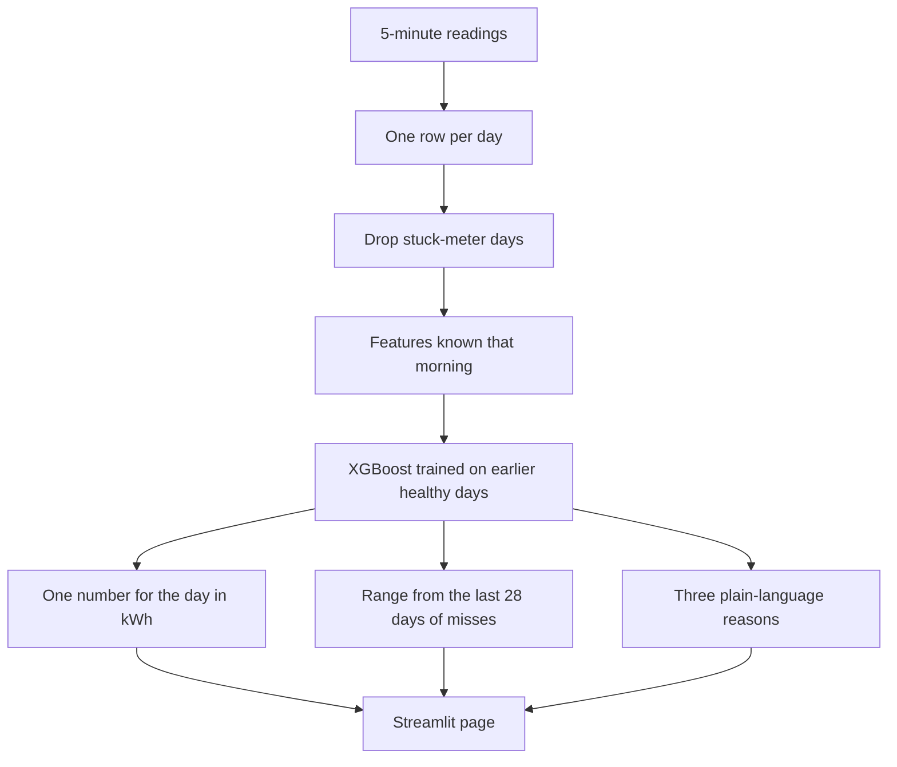

# Proof of concept: next-day electricity

This note is for the technical team. It says what we built, why, and how to read the result.

The product is one number each morning: expected electricity for that day, in kWh, plus a range. A kWh is one unit on an electricity bill. The page that shows this is `app.py`. The work that builds the number is `forecast.py`.

## Flow

## 1. Data

Source file: `data_D.csv`.

One Daikin outdoor unit, sampled every 5 minutes, from 19 April 2022 through 30 June 2023. Timestamps in the file are UTC. On the page, a day runs midnight to midnight, India time, because the unit is busy in daytime office hours on that clock.

The useful columns are power (kW), outdoor temperature, operating mode, and the timestamp. The file also has indoor and outdoor pipe temperatures, compressor shell temperatures, refrigerant pressures, setpoint, on/off, and expansion-valve pulse. Those describe the machine while it is running. They are kept in the file and are not used to guess tomorrow.

## 2. Data processing

Each 5-minute power reading is turned into energy: kW times 5/60. Those slices are summed into one kWh total per day.

A day is kept as a real answer only if both of these are true:

- At least 90% of the 288 expected 5-minute slots are present.
- The power meter is not stuck.

A stuck day repeats one high number all day (about 1.2 kW or 2.5 kW) with almost no variation. A live compressor does not do that. We found 34 such days, about 1,480 recorded kWh. They are left out of training and left out of the score. The next morning still gets a forecast. It uses the last healthy day instead of the stuck total.

A day that stays near 0.1 kW is a real off day. Those stay in. There are 78 quiet days under 3 kWh. A typical weekday in the file is about 22 kWh. A typical weekend day is about 2.4 kWh.

After cleaning there are 347 usable days.

## 3. PCA

We did not use PCA.

PCA compresses many columns into a few combined scores. That would help if we fed the model a pile of pipe temperatures and pressures. We do not. Those sensors move because the compressor is already running, so they describe today’s kilowatts, not tomorrow’s. Mixing them into components would also hide the names we show on the page (“yesterday was hot”, “it is a Friday”). XGBoost can use the small set of real inputs below without that step.

## 4. Feature engineering

We do not give the model the raw 5-minute table. For each morning we build one row of facts that are already known before that day unfolds.

| Feature | Meaning |
|---|---|
| Day of week, weekend, month | Calendar. Known in advance. |
| Yesterday’s kWh | Only if yesterday was a healthy day. |
| kWh two days ago | Same rule. |
| Same weekday last week | The total from 7 days earlier, if that day was healthy. |
| Typical recent weekday | Median of the last 4 times this weekday was healthy. |
| Past week average | Mean kWh of healthy days in the last 7 days. |
| Last healthy day | Most recent trustworthy total, and how many days ago it was. |
| Outdoor temperature yesterday | And the average outdoor temperature of the past 7 days. |
| Hours running yesterday | Time spent above 0.2 kW. |
| Heating yesterday | Yes or no, from operating mode. |

One optional input, used only by the second choice on the page: today’s average outdoor temperature. In this proof that value is the day’s real average, standing in for a weather forecast. A live forecast issued in the morning would be a little less exact. On the months we checked, adding it changed the typical miss by less than 1 kWh, because yesterday’s temperature already carried most of that signal.

The strongest inputs on the checked days, in order, were:

1. Yesterday’s outdoor temperature
2. What this weekday usually uses
3. This weekday last week
4. Which day of the week it is
5. Yesterday’s electricity

## 5. Model

We use XGBoost, a small set of decision trees (`max_depth` 3, 80 trees, learning rate 0.06, extra regularization so a few hundred days are not memorized).

We use it because the pattern is a few sharp cuts: weekend versus weekday, a hot week versus a mild week, a heavy recent Friday versus a quiet one. Trees make those cuts, they accept a missing yesterday, and they can name which input moved one morning’s number. A neural net wants more years than this file has. A straight-line model misses the weekend drop, which is the largest fact in the data.

How a morning is produced:

- Train only on healthy days before that morning.
- Predict that day’s kWh. The guess is not allowed to go below zero.
- The range is the band that held the middle 80% of recent misses (10th to 90th percentile of actual minus predicted). It looks at the previous 28 days, and prefers weekday misses for a weekday and weekend misses for a weekend when there are at least 8 of those.
- The three sentences on the page are the three largest tree contributions for that morning, written in plain language. This is the same idea as SHAP for a tree model. We did not fit a second model to explain the first.

## 6. Training and evaluation split

We did split the data. We did not shuffle it.

| Role | Which days | How many |
|---|---|---|
| History the model may learn from | Healthy days before the morning being guessed | 263 healthy days before 1 April 2023, then each new healthy day is added after it has happened |
| Evaluation | 1 April 2023 through 30 June 2023 | 71 healthy days |
| Not used as answers | Stuck-meter days, and days missing too many readings | 34 stuck days, plus logger gaps |

For each of those 71 mornings the model is fit only on healthy days **before that morning**, then it guesses that day. The real total is revealed afterward and can be used the next morning. That is a walk-forward split. It matches live use.

A random 80/20 split was not used. It would put later days into training and earlier days into the test, so the model would see the future while guessing the past.

The 71 days are a cooling season. Winter is inside the history the model can learn from. It is not inside the score.

## 7. Metrics and benchmark

This is a quantity, not a yes-or-no class. Precision, recall, and a confusion matrix do not apply. Those appear only if we later define classes such as quiet / normal / heavy.

The benchmark scored on the **same 71 days** is a simple rule: repeat this weekday from last week. If that day is missing, use the recent typical value for that weekday. No other algorithm (linear regression, another tree library, or a neural net) was scored in this proof.

| | Repeat last week | XGBoost |
|---|---|---|
| Typical miss (MAE) | 10.3 kWh | 5.1 kWh |
| Misses as a share of electricity used (WAPE) | 50% | 25% |
| Bias (predicted minus actual) | about 0.2 kWh low | about 1.5 kWh low |

The forecast cuts the typical miss roughly in half. It runs a little low. The last-week rule is almost unbiased and much wider of the mark.

The range contained the real use on **54 of 71 days** (76%). The aim is about 80%. The last-week rule has no range.

A second XGBoost run that was also shown that day’s real outdoor temperature missed by 5.1 kWh as well (25% of electricity, range right on 53 of 71 days). Yesterday’s temperature already carried most of that signal, so the extra input did not beat the benchmark by any more.

If someone asks for a percentage, the honest one is the WAPE line: misses add up to 25% of the electricity used. That is not classification accuracy.

## 8. Streamlit page

`app.py` is the client view. It reads the files in `artifacts/` and does not retrain until someone adds readings.

What the page does:

- Lets you pick a morning and see the number, the range, and, when the day has already happened, the real use.
- Says whether that real use landed inside the range.
- Gives three reasons for the number.
- Plots every checked morning: forecast, range, and actual. Gaps are stuck days or logger gaps.
- States the metrics above in plain language.
- Explains the stuck-meter rule and what the readings are.
- Accepts a new CSV with the same columns as `data_D.csv`. New times are stored in `data_extra.csv`. The original file is not overwritten. The forecast is then rebuilt (about half a minute).

The first choice in the morning list is the day after the last reading. For the original file that is Saturday 1 July 2023, which has no actual yet.

## 9. Running it on a new day

A new day needs yesterday’s 5-minute rows: `timestamp`, `power` in kW, and outdoor temperature. Operating mode is useful so yesterday can be marked heating or cooling.

Two ways to add them:

- On the page: **Add new readings**, then **Update the forecast**.
- Without the page: drop the CSV in `incoming/` and run `python forecast.py`.

A morning schedule can run that command after the file arrives. Refresh the page and the new morning is there. The page does not pull data from the air conditioner by itself.

## What this proof is not

- It does not forecast every 5 minutes. The hourly shape of the day is a later step. It would be the usual weekday or weekend shape scaled to the same daily total.
- It does not use PCA.
- It does not use compressor temperature, pressure, or valve pulse as forecast inputs.
- The checked months are April–June 2023, a cooling season. Winter is in the training history. It is not in the score table above.
